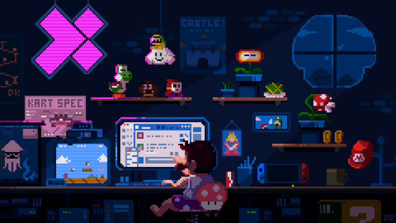

## Bem-Vindos ao Meu Perfil 👋

## About Me

Hello everyone 👋, I'm Clarisse Diniz, a Systems Information graduate and Frontend Developer.

### Main Stacks

#### Frontend Skills
-  HTML5
-  CSS3
-  JavaScript
-  Angular

#### Backend Skills
-  Java
-  Spring
-  TypeScript

### Contact Me!

## Sobre Mim

Olá Pessoal!👋, Me chamo Clarisse Diniz, sou estudante de Sistemas de Informação e Desenvolvedora Frontend

### Principais Habilidades

#### Frontend 
-  HTML5
-  CSS3
-  JavaScript
-  Angular

#### Backend 
-  Java
-  Spring
-  TypeScript

### Entre em Contato!

